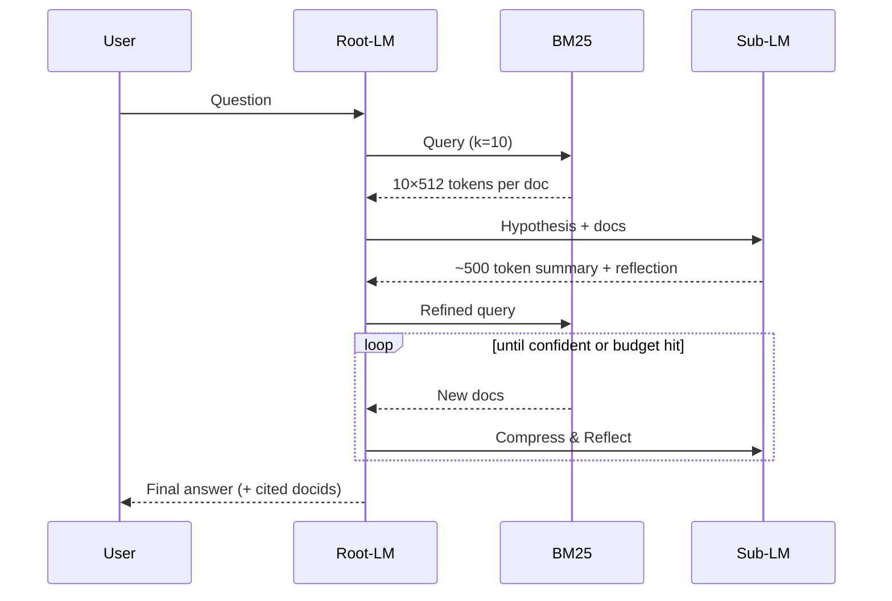

## Main takeaway

Building off of the great post on [Recursive Language Models](https://alexzhang13.github.io/blog/2025/rlm/), I ran a similar experiment, and found that RLM with sub-LM summarization and reflection achieved a 2.5X increase in accuracy (10% -> 25%, using Gemini Flash 2.5) on [BrowseComp Plus](https://arxiv.org/abs/2508.06600), compared to a ReAct baseline using the same search tool (BM25).

The key insight is that we are able to reduce context rot for the root-LM, by delegating document processing, summarization, and reflection to the sub-LM (depth == 1). Instead of the ReAct agent continuously appending documents and growing context at a rapid rate (10 documents per search, truncate to first 512 tokens, 15 iterations = 77K tokens), the sub-LM is able to limit context growth per iteration to ~500 tokens, a 10× reduction that significantly improves its ability to answer the multi-hop research question. Interestingly, document evidence recall was around the same for ReAct and RLM (~32%), further demonstrating that the improvement is from reducing context rot, rather than improving retrieval.

Another key factor of reducing context rot is traversing the search more efficiently. I observed a 13% decrease in average number of searches per query from 8.95 in ReAct to 7.75 in RLM. From ablations, the sub‑LM’s reflections on the hypothesis and suggested query refinements were a significant step up from the simple tool outputs the root‑LM sees in ReAct.

The downside is that the RLM process is roughly 2.6× slower (per‑query average of 203s vs 79s). Parallelization could help, but it’s not obviously a silver bullet given the sequential nature of multi‑hop research. Future experiments will combine RLM with a Memory Bank to reduce processing time and context.

---

## Motivation

I wrote about context rot and continual learning in the [previous post](https://tangbyron.github.io/posts/anti-patterns-as-guardrails/), so I won't belabor the point. I did find that the BrowseComp Plus dataset is a perfect one for exploring this problem, at least on the text modality.

---

## Dataset: BrowseComp Plus

[BrowseComp Plus](https://arxiv.org/html/2508.06600v1) (and the original [BrowseComp](https://openai.com/index/browsecomp/)) is a multi-hop question answering benchmark designed to stress-test retrieval systems. It contains:

- **830 queries** requiring cross-document synthesis
- **100,195 documents** wide range of document length
- **~6.1 evidence docs, 2.9 gold docs, and ~76.3 hard negatives** per query

Shoutout to the authors for putting the dataset together, I found it very cool that answers are contained in multiple documents, and requires multi-hop search and reasoning. My initial attempts sent Gemini down deep rabbit holes and I ended up burning some $ on large context API calls. There's a reason why major model releases like [Kimi K2 Thinking](https://huggingface.co/moonshotai/Kimi-K2-Thinking) in Nov 2025 still reference the performance on this dataset.

### Synthetic Example

Per the dataset card’s policy (“BENCHMARK DATA SHOULD NEVER APPEAR AS PLAIN TEXT ONLINE” [HF dataset card](https://huggingface.co/datasets/Tevatron/browsecomp-plus)), here’s a representative synthetic example (not from the benchmark):

> **query**: "Identify the 2012–2016 sci‑fi short story that won a major award, is set on a tidally‑locked planet, and whose author later chaired the Nebula Awards."
>
> **multi-hop challenges**:
> 1. Search for award-winning sci-fi stories (2012-2016)
> 2. Filter by setting (tidally-locked planet)
> 3. Cross-reference author's later career (Nebula chair)
> 4. Synthesize across 3+ documents with different constraints

---

## Baseline: Single LLM call

**Setup**: The simplest possible approach. Execute one BM25 search with k=20 documents, truncate each to the first 512 tokens, pass directly to Gemini 2.5 Flash, and ask for the final answer.

**Results**:
- **Accuracy: 0% (0/20 correct)**
- Evidence recall: 2%
- Average time: 118s per query

Interestingly, with BM25 search using k=20, there are times that we retrieved the golden evidence docs. But even so, the model could not synthesize the final answer. Again showcasing the multi-hop nature of this dataset. 

---

## Experiment 1: ReAct Baseline

### Architecture

The ReAct pattern ([Yao et al., 2023](https://arxiv.org/abs/2210.03629)) enables iterative search through a simple loop: Reason → Act (tool call) → Observe (append results) → Repeat.

```
Query → Root LM
         ↓
    ┌────────────┐
    │ Reasoning  │  Think about what to search
    └─────┬──────┘
          ↓
    ┌────────────┐
    │ Tool Call  │  Execute BM25 search
    └─────┬──────┘
          ↓
    ┌────────────┐
    │ Append     │  Add results to conversation
    └─────┬──────┘
          ↓
    Loop back (max 15 iterations)
```

### Implementation

Kept it simple, no frameworks, just native Gemini SDK function calling in ~20 lines of core logic:

```python
# Core ReAct loop
for iteration in range(max_iterations):
    response = client.models.generate_content(
        model="gemini-2.5-flash",
        contents=contents,  # Growing context from appending search results
        config=types.GenerateContentConfig(
            tools=[search_tool],  # BM25 function
            system_instruction=REACT_SYSTEM_PROMPT,
            tool_config=types.ToolConfig(
                function_calling_config=types.FunctionCallingConfig(
                    mode='AUTO'  # Let LLM decide when to call
                )
            )
        )
    )

    if function_calls:
        results = execute_search(...)
        contents.append(...)  # Context accumulates here
        continue
    else:
        return final_answer
```

### Results

Using **Gemini 2.5 Flash** (knowledge cutoff of Jan 2025, pre-dating BrowseComp Plus release to avoid contamination):

- **Accuracy: 10.00% (2/20 correct)**
- Evidence recall: 32% (15x better than single search!)
- Average 8.95 searches per query
- Average 9.8 iterations
- Average time: 79.25s per query

It was encouraging to see non‑zero accuracy (was worth celebrating at the time)! Somewhat matches the 15.54% reported in the original [BrowseComp Plus](https://arxiv.org/abs/2508.06600) paper. I'm sure there was some more prompt tuning for the paper, but since that's not the primary objective of this experiment, I just went with a generic deep research prompt.

I repeated the ReAct baseline a few times, the key issue is the linear context accumulation, since each iteration simply appends the search results to the context:
- Iteration 1: 5,120 tokens (10 docs × 512 tokens)
- Iteration 5: 25,600 tokens
- Iteration 15 (max): 76,800 tokens

While this is well below the 1 million token context window for Gemini Flash 2.5, I observed that the root-LM was getting bogged down from the ever increasing context, and it would repeat very similar search queries with a few keyword differences, and prematurely "give up" after 10+ iterations.

---

## Experiment 2: Recursive Language Model

### Architecture

To reduce context rot on the root-LM, we introduce sub-LM at depth == 1



The sub-LM is responsible for reviewing all of the documents, comparing it against the original query from BrowseComp, the search query and hypothesis from the root-LM. It’s able to summarize the information, reflect, and provide feedback to the root‑LM on how to update its query. It condenses the output to ~500 tokens, which means 10X decrease in tokens for the root-LM, as it iterates through the research process.

### Root-LM and Sub-LM interaction

In addition to the obvious benefits of compression, I found that the root/sub LM interaction to be interesting and beneficial. Specifically, feedback from the sub-LM was critical in introducing new search patterns in the root-LM, which prevented the root-LM from getting "stuck" in a single train of thought.

The root-LM articulates its hypothesis every turn using a structured 5-step format:

```
**Process (every turn):**

1) **Observations**: Review question, summarize what new signal
   the latest evidence added.

2) **Evidence Gaps**: List what's still missing to answer confidently.

3) **Leading Hypothesis**: State your current best hypothesis
   in one clear sentence.

4) **Search Plan**: Choose your next search query:
   Query: "..."
   Rationale: Why this specific query will fill the evidence gaps.

5) **Final Answer**: When evidence converges and you're confident,
   provide answer with document IDs and confidence (0-100).
```

The sub-LM receives this hypothesis and provides feedback:

```python
def build_feedback_prompt_v2(..., leading_hypothesis):
    """Build hypothesis-aware sub-LM prompt with reflection"""
    prompt = f"""
    ORIGINAL QUESTION: {original_query}
    CURRENT SEARCH: "{search_query}"

    LEADING HYPOTHESIS FROM THE ANALYST:
    \"\"\"{leading_hypothesis}\"\"\"

    Your goals:
    1. Review all documents and return key findings summary including:
       - Key facts that support or contradict the hypothesis
       - Detailed relationships and connections between entities

    2. For highly relevant documents, conduct a deep dive into the text.

    3. Suggest how the analyst should update the hypothesis if documents
       provide strong contradictory evidence.

    4. Note any follow-up keywords or entities the analyst should
       consider next.

    After your document analysis, provide:

    **Suggested Next BM25 Queries:**
    - Query 1: "..."
    - Query 2: "..."
    - Query 3: "..."
    """
```

### Results

Accuracy of 25%, a roughly 2.5X improvement over ReAct. A huge caveat is that this is only on 20 queries, repeated over multiple runs of the experiment. It's a bit expensive to run these experiments (already used up about $100 of Gemini credits), and there's more low hanging fruits to explore in the RLM framework, so I'll stop at 20 for now.

| Metric | Single BM25 | ReAct | RLM | Change (ReAct→RLM) |
|--------|-------------|-------|--------|-------------------|
| **Accuracy** | 0.00% | 10.00% | **25.00%** | **+150%** |
| **Evidence Recall** | 2.08% | 31.64% | 32.24% | +1.9% |
| **Avg Searches** | 1 | 8.95 | 7.75 | -13.4% |
| **Avg Confidence** | - | 39.75% | 51.25% | +28.9% |
| **Avg Time (s)** | 118 | 79 | 203 | +156.8% |

It was great to see the accuracy increase, and very interesting that it wasn't due to evidence recall, which was roughly about the same between ReAct and RLM. Rather, the context reduction from summarization, and also getting to the evidence with fewer iterations (-13%), means a 10X+ reduction in context for the root-LM, which significantly helped with accuracy.

---

## Limitations & Future Work

Small sample size is the obvious one, I'll increase this in the near future, once we explore the following augmentations to RLM:
1. for the apples to apples comparison between ReAct and RLM, we are just using the BM25 search tool. Adding Regex, Word Search, and Semantic search will be fast follows
2. for now, the tools are static, what if we allow the root-LM dynamically create tools (code execution) that spin up sub-LMs? what if we allow depth > 1, and the sub-LMs can then dynamically create and execute additional actions?
3. As mentioned in the [previous post](https://tangbyron.github.io/posts/anti-patterns-as-guardrails/), as we give more freedom to the RLM to dynamically execute, it'll surely come upon happy/unhappy paths. What if we encode these as memory, and allow the RLM to also dynamically retrieve from this memory bank for past reasoning/execution traces?

---

*This work was inspired by [Recursive Language Models](https://alexzhang13.github.io/blog/2025/rlm/) by Alex Zhang and builds on the [BrowseComp Plus dataset](https://arxiv.org/html/2508.06600v1).*

*Views are strictly my own. Experiments based only on public datasets.*

*Published: November 9, 2025*
