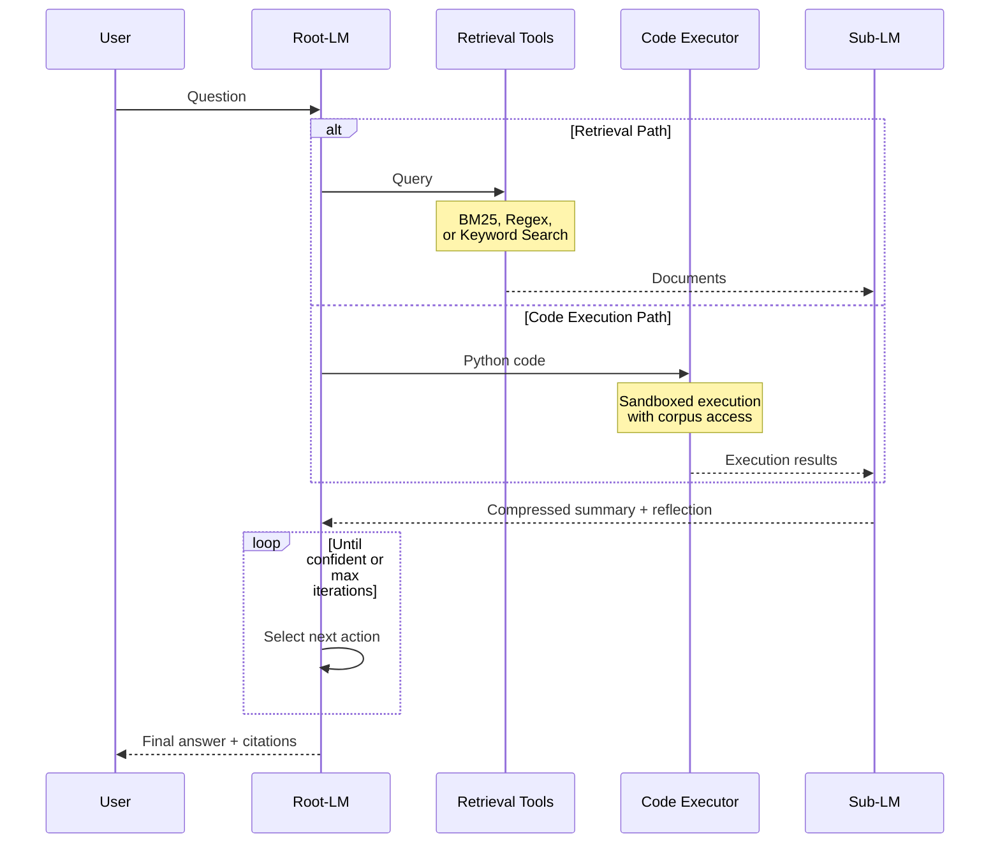

_This is Part 3 in an ongoing series on continual learning for LLM agents: from [Reasoning Banks](https://tangbyron.github.io/posts/anti-patterns-as-guardrails/) → [Recursive Language Models](https://tangbyron.github.io/posts/recursive-language-models/) → RLM + Code Execution._


_Visual summary of the architecture and key code patterns_

## Main takeaway

Combining Code Execution with Recursive Language Models (RLM) achieved **60% accuracy** on [BrowseComp Plus](https://arxiv.org/abs/2508.06600) in small-scale experiments with Gemini 2.5 Flash, all without using embeddings. This is a 6X improvement compared to using the ReAct agent design, and is in the same ballpark as the BM25 only configurations of o3 and GPT-5 on the public [leaderboard](https://huggingface.co/spaces/Tevatron/BrowseComp-Plus). I want to emphasize that these are still just directionally correct early findings, since I'm running on small sample sizes. Given the costly nature of testing various experiments (lots of tokens!), I prioritized rapid architecture experimentation, vs running on the entire corpus.

The breakthrough was letting the Root-LM write python code to programmatically chain search tools, create complex filters, and parallelize search. The Root-LM was quite creative, and often created logic that would have taken 3-4 iterations in the traditional LLM<>Tool loop. Code execution often resulted in huge outputs, which paired extremely well with the RLM Sub-LM summarizer that prevents context rot.

I intentionally skipped adding in semantic search tools leveraging embeddings, since real-world scenarios are often dynamic. Users can upload new documents, ask the agent to search online, or work with constantly changing corpora. Pre-building vector stores isn't always feasible. (On the flip side, I also don't quite believe that "grep is all you need", hybrid search wins for real-world use cases.)

The journey: 0% (single BM25 search + LLM) -> 10% (ReAct + BM25) -> 25% (RLM + BM25) -> 40% (RLM + more search tools) -> 60% (RLM + search tools + code execution)

---

## 0 to 60

Building on my [previous post on Recursive Language Models](https://tangbyron.github.io/posts/recursive-language-models/), here's the progression:

| Variant                                                | Accuracy (approx) |
|--------------------------------------------------------|-------------------|
| Single BM25                                            | 0%                |
| ReAct                                                  | 10%               |
| RLM + BM25                                             | 25%               |
| RLM + BM25 + Regex and Keyword Scan                    | 35–40%            |
| RLM + BM25 + Regex and Keyword Scan + Code Execution   | 60%               |

---

## Code Execution

### Motivation

As [Anthropic notes](https://www.anthropic.com/engineering/code-execution-with-mcp), adding more specialized tools creates cognitive overhead for the LLM. Each tool needs its own schema, parameters, and usage patterns to be encoded into the prompts. Even with just three search tools, it got messy real fast. Code execution was much more elegant.

The Root-LM got a sandboxed Python environment with:

- **Full Python standard library**: `re`, `json`, etc.
- **BM25 search API**: `bm25_search(query, bm25, docids, k=20)`
- **Document access**: `get_doc_text(doc_id, corpus_dict)`

It was quite amazing to see how creative the Root-LM was. From reading through the logs, it "felt" like it was freed from having to use these pre-defined search tools, one at a time. There were so many cool patterns, I'm including a few of my favorites below:

### Pattern 1: Progressive Refinement (BM25 + complex filtering)

**Task**: Finding academic papers about educational technology published between 2011-2015 with multiple co-authors.

In the system prompt, we provide research heuristics like "go broad and then narrow". Sounds easy to do, but hard when the agent is bound to using search tools turn by turn.
With code execution, it's suddenly possible! The code below allows the agent to review 500 docs in 1.3 seconds.
There's something...magically pragmatic to see the LLM implement code to "count" the number of authors, to satisfy the search requirement. Not very elegant, but it works!

```python
results = bm25_search('article online learning educational technology platform teaching methods digital classroom 2010 2011 2012 2013 2014 2015 2016', bm25, docids, k=500)

found_articles = []
for doc_id, score in results:
    text = get_doc_text(doc_id, corpus_dict)
    if not text: continue

    # Check for publication year between 2011 and 2015
    pub_year = None
    for year in range(2011, 2016):
        if str(year) in text:
            pub_year = year
            break
    if not pub_year: continue

    # Check for educational technology context
    topic_keywords = ['online learning', 'student engagement', 'virtual classroom', 'educational platform', 'remote teaching', 'digital curriculum', 'assessment', 'pedagogy', 'learning outcomes', 'technology integration']
    if not any(keyword in text.lower() for keyword in topic_keywords): continue

    # Attempt to count authors (>2 required)
    author_count_match = re.search(r'(?:by|authors?[:\n])\s*([A-Z][a-z]+(?:\s[A-Z][a-z]+)?(?:,\s*[A-Z][a-z]+(?:\s[A-Z][a-z]+)?){2,})', text)
    if author_count_match:
        authors_list = author_count_match.group(1).split(',')
        if len(authors_list) > 2:
            found_articles.append({'doc_id': doc_id, 'year': pub_year, 'authors_snippet': author_count_match.group(0)})
```
### Pattern 2: Adaptive Fallback Strategy

**Task**: Extracting an athlete's height from a sports database with fallback to broader search.

This pattern occurred a lot, the Root-LM was able to quickly test a hypothesis, but instead of waiting another turn to pivot, it adds a "self healing" fallback step to search more. Again, amusing to see it use code to do some derivation (m to cm) and math. (BrowseComp Plus has a lot of queries requiring derivations like "this institution was open for 671 days", and the LLM has to compile lists of potential start/close dates and derive to see if it's a match. Fun dataset!)

```python
athlete_doc_id = 'doc12345'
athlete_text = get_doc_text(athlete_doc_id, corpus_dict)

# Try specific document first
height_pattern = r'height:\s*(\d\.\d{2})\s*m'
height_match = re.search(height_pattern, athlete_text, re.IGNORECASE)

if height_match:
    height_m = float(height_match.group(1))
    height_cm = height_m * 100
    print(f"Athlete's height: {height_cm:.2f} cm")
else:
    print("Height information not found in doc12345. Expanding search.")
    # Fallback: broader search
    results = bm25_search('professional athlete height statistics', bm25, docids, k=10)
    for doc_id, score in results:
        text = get_doc_text(doc_id, corpus_dict)
        height_match = re.search(height_pattern, text, re.IGNORECASE)
        if height_match:
            height_m = float(height_match.group(1))
            height_cm = height_m * 100
            print(f"Athlete's height found in {doc_id}: {height_cm:.2f} cm")
            break
```

### Pattern 3: Parallel Information Gathering + Sub-LM Compression

**Task**: Comparing exhibition space and visitor capacity across multiple museums.

The agent tested multiple hypotheses in parallel, and batched document retrieval. Retrieved 15 documents (14,797 characters) in a single execution, triggered Sub-LM compression, which condensed it to 1,630 characters (~9x reduction). In this case, the Sub-LM summary directly contained the correct answer. 

```python
doc_ids_museum_a_area = bm25_search('Metropolitan Museum exhibition space square feet', bm25, docids, k=5)
doc_ids_museum_b_area = bm25_search('British Museum gallery area square feet', bm25, docids, k=5)
doc_ids_museum_c_capacity = bm25_search('Louvre Museum daily visitor capacity', bm25, docids, k=5)

for doc_id in doc_ids_museum_a_area:
    print(f'[{doc_id}]: {get_doc_text(doc_id, corpus_dict)}')
    # ... (repeat for other museums)
```

### Error handling

I did want to note that code execution was only successful 78% of the time, failures were typically due to overly complex regex patterns. In the case of failure, the error was passed back to the Root-LM, and triggered a retry that was typically successful. 

### Sandbox Constraints

- 30-second timeout per execution (enforced via SIGALRM)
- Output truncation at 15,000 characters (~5,000 tokens) with intelligent line-boundary truncation
- Module whitelist: only `re` and `json` (no numpy, pandas, requests, etc.)
- No network access: no socket, urllib, requests, or any I/O modules
- No file system access: no `open()`, `os`, `pathlib`, or file operations
- Read-only corpus access: can read `corpus_dict`, `query_text`, BM25 index, and `docids` but cannot modify them
- Restricted builtins: only safe built-ins like `print`, `len`, `range`, type constructors – no `exec`, `eval`, `compile`, `__import__` (except a controlled `safe_import`)

---

## Architecture



---

## Limitations

**Small sample size**: 20 queries x multiple runs is a good signal but not definitive. Scaling to the full 830-query benchmark is needed.
**Latency**: Averaging 558 seconds (9.3 minutes) per query for hard cases. This works for research tasks but isn't suitable for real-time applications.

---

## Future Directions

The natural next step is exploring memory systems for successful paths, and anti-patterns. For example, when the agent discovers that "progressive refinement" works for academic paper queries, it should remember and reuse this pattern. To me, this is a version of "continual learning" that motivated the series of blog posts.

This aligns with Anthropic's [Agent Skills](https://www.anthropic.com/engineering/equipping-agents-for-the-real-world-with-agent-skills) work and the [Memory Reasoning Bank](https://arxiv.org/pdf/2509.25140) paper - encoding successful reasoning traces and retrieval strategies as reusable knowledge.

---

*This work builds on [Recursive Language Models](https://alexzhang13.github.io/blog/2025/rlm/) by Alex Zhang, Anthropic's [code execution research](https://www.anthropic.com/engineering/code-execution-with-mcp), and the [BrowseComp Plus dataset](https://arxiv.org/html/2508.06600v1).*

*Views are strictly my own. Experiments based only on public datasets. Code examples have been genericized to respect the BrowseComp Plus dataset policy ("BENCHMARK DATA SHOULD NEVER APPEAR AS PLAIN TEXT ONLINE").*

*Published: November 22, 2025*